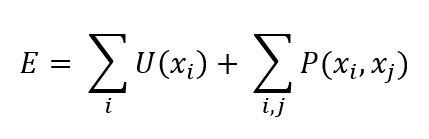
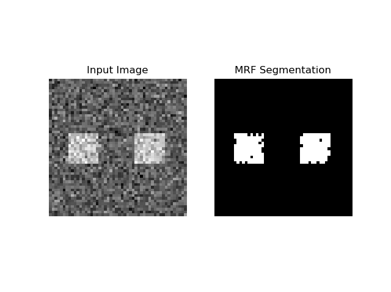

# MRF
## Markov Random Field for binary image segmentation

## Markovian Image Analysis
The Markov Random Field classifier assigns the maximum likelihood label to a pixel based on its value and neighborhood.  
In 2D, the Markovian property is represented by a pixel's 8-neighborhood or 4-neighborhood.

This is done by minimizing the following Energy term:

     

Where the energy, E, is composed of the Unary term, U and Pairwise (Binary) term, P.

The unary term represents the cost of assigning a label to a pixel based on some relationship between the pixel value and the label.
The binary term is a smoothness parameter, specifying the cost for assigning differing labels to neighboring pixels.

## Graph Representation
Minimizing the energy term is implemented as a graph problem: each pixel is a node, and edges exist between neighboring pixels.

All pixels also have an edge with the source and sink.

Using the MinCut-MaxFlow algorithm, the optimal cut can be produced separating pixels belonging to the sink from those belonging to the source, thus yielding the pixel-wise label.

     

